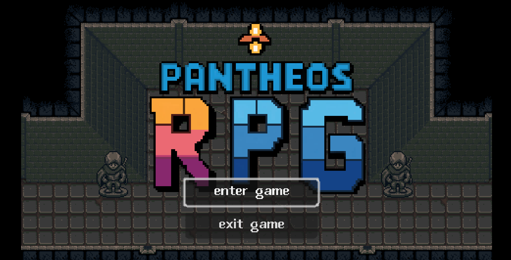

# 🎮 Pantheos RPG - Official Website

[](https://saladnigek.github.io/PAN/)
[](LICENSE)
[](https://developer.mozilla.org/en-US/docs/Web/HTML)
[](https://developer.mozilla.org/en-US/docs/Web/CSS)
[](https://developer.mozilla.org/en-US/docs/Web/JavaScript)

> An immersive MMORPG adventure with pixel-art graphics and engaging gameplay.



## 🌟 Features

- 🎨 **Beautiful Pixel Art Design** - Nostalgic retro graphics with modern polish
- 🎮 **Full MMORPG Experience** - Character progression, quests, and multiplayer
- 📱 **Fully Responsive** - Works perfectly on desktop, tablet, and mobile
- ♿ **Accessible** - WCAG 2.1 AA compliant for all users
- ⚡ **Fast Performance** - Optimized loading and smooth animations
- 🔐 **User Accounts** - Login, signup, and profile management

## 🚀 Live Demo

Visit the live website: **[https://saladnigek.github.io/PAN/](https://saladnigek.github.io/PAN/)**

## 📥 Download Game Client

Download the latest version from [Releases](https://github.com/saladnigek/PAN/releases)

### System Requirements
- **OS:** Windows 10/11 (64-bit)
- **Processor:** Intel Core i3 or AMD equivalent
- **Memory:** 4 GB RAM
- **Graphics:** DirectX 11 compatible graphics card
- **Storage:** 2 GB available space
- **Network:** Broadband internet connection

## 🛠️ Technology Stack

- **HTML5** - Semantic markup for better SEO and accessibility
- **CSS3** - Modern styling with CSS Grid, Flexbox, and animations
- **JavaScript (ES6+)** - Modular, organized code with no dependencies
- **LocalStorage API** - Client-side data persistence
- **Google Fonts** - Press Start 2P and Roboto fonts

## 📁 Project Structure

```
PAN/
├── index.html          # Main HTML file
├── styles.css          # Organized CSS with variables
├── script.js           # Modular JavaScript
├── README.md           # Project documentation
├── assets/             # Images and resources
│   ├── logo.png
│   ├── bg.png
│   ├── profile.png
│   └── ...
└── docs/               # Additional documentation
    ├── IMPROVEMENTS.md
    ├── QUICK_START.md
    └── SUMMARY.md
```

## 🎯 Key Features

### User Authentication
- ✅ Login/Signup system
- ✅ Password reset functionality
- ✅ Profile management
- ✅ Account deletion with confirmation

### Game Information
- ✅ Detailed game overview
- ✅ System requirements
- ✅ Latest news and updates
- ✅ Contact form

### Responsive Design
- ✅ Mobile-first approach
- ✅ Breakpoints: 480px, 768px, 1024px+
- ✅ Touch-friendly interface
- ✅ Optimized for all screen sizes

### Accessibility
- ✅ WCAG 2.1 AA compliant
- ✅ Keyboard navigation
- ✅ Screen reader support
- ✅ ARIA labels and roles
- ✅ Focus indicators
- ✅ Semantic HTML

## 🚀 Getting Started

### For Users
1. Visit [https://saladnigek.github.io/PAN/](https://saladnigek.github.io/PAN/)
2. Create an account or login
3. Download the game client
4. Start playing!

### For Developers

#### Clone the Repository
```bash
git clone https://github.com/saladnigek/PAN.git
cd PAN
```

#### Run Locally
Simply open `index.html` in your browser. No build process required!

#### Or use a local server:
```bash
# Using Python
python -m http.server 8000

# Using Node.js
npx http-server

# Using PHP
php -S localhost:8000
```

Then visit `http://localhost:8000`

## 📊 Code Quality

- ✅ **Organized:** Separated HTML, CSS, and JavaScript
- ✅ **Modular:** Clear separation of concerns
- ✅ **Documented:** Comprehensive comments and documentation
- ✅ **Maintainable:** Easy to understand and modify
- ✅ **Performant:** Optimized for fast loading
- ✅ **Accessible:** Works for everyone

## 🎨 Design Highlights

### Color Palette
- Primary Blue: `#3985C1`
- Primary Orange: `#FAA53C`
- Accent Blue: `#2563eb`
- Dark Blue: `#3E4A66`

### Typography
- **Headings:** Press Start 2P (pixel font)
- **Body:** Roboto (clean, readable)

### Animations
- Smooth transitions
- Loading animations
- Hover effects
- Parallax scrolling

## 📱 Browser Support

- ✅ Chrome 90+
- ✅ Firefox 88+
- ✅ Safari 14+
- ✅ Edge 90+
- ✅ Mobile browsers (iOS Safari, Chrome Mobile)

## 🤝 Contributing

Contributions are welcome! Please feel free to submit a Pull Request.

1. Fork the repository
2. Create your feature branch (`git checkout -b feature/AmazingFeature`)
3. Commit your changes (`git commit -m 'Add some AmazingFeature'`)
4. Push to the branch (`git push origin feature/AmazingFeature`)
5. Open a Pull Request

## 📝 License

This project is licensed under the MIT License - see the [LICENSE](LICENSE) file for details.

## 📞 Contact

- **Email:** contact@pantheos4c.com
- **Discord:** [Join our server](https://discord.gg/your-invite)
- **Website:** [https://saladnigek.github.io/PAN/](https://saladnigek.github.io/PAN/)

## 🙏 Acknowledgments

- Pixel art assets and design
- Google Fonts for typography
- Community feedback and support

## 📈 Project Stats


## 🗺️ Roadmap

- [x] Website launch
- [x] User authentication
- [x] Responsive design
- [x] Accessibility compliance
- [ ] Game client release
- [ ] Multiplayer features
- [ ] Mobile app
- [ ] Community features

## 📸 Screenshots

### Desktop View


### Mobile View


### Game Features


---

<div align="center">

**[Website](https://saladnigek.github.io/PAN/)** • 
**[Download](https://github.com/saladnigek/PAN/releases)** • 
**[Documentation](README.md)** • 
**[Report Bug](https://github.com/saladnigek/PAN/issues)** • 
**[Request Feature](https://github.com/saladnigek/PAN/issues)**

Made with ❤️ by the Pantheos RPG Team

© 2024 Pantheos RPG. All rights reserved.

</div>
